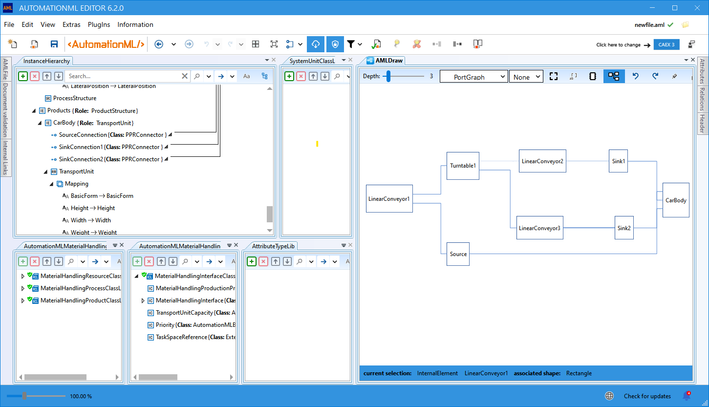

---

![][1]

---

# AutomationML Editor

## News

The AutomationML Editor [Version 6.2.0 release candidate](https://github.com/AutomationML/AutomationMLEditor/releases/tag/v6.2.0) is now available. With version 6.2.0, the AutomationML Editor offers more **support for the management and creation of AutomationML class libraries** according to [Conventions for the modelling of AutomationML libraries](https://www.automationml.org/wp-content/uploads/2023/11/Conventions-for-modelling-AutomationML-libraries-V1.0.0-external.pdf). Compared to previous versions, the use of the class and attribute type libraries, offered by AutomationML, has been fundamentally improved and standardized. These libraries are only integrated into your own documents via external references, using fixed server URLs. Version 6.2.0 is not yet offered by the automatic update function of the editor, but must be downloaded and installed manually via this [link](https://github.com/AutomationML/AutomationMLEditor/releases/tag/v6.2.0). 

You can find detailed instructions on how to use the new features in the wiki on the following topics:
- [Using external Sources](https://github.com/AutomationML/AutomationMLEditor/wiki/UsingExternals)
- [External Source Windows](
https://github.com/AutomationML/AutomationMLEditor/wiki/Layout#External-source-windows)
- [Preview Windows](https://github.com/AutomationML/AutomationMLEditor/wiki/Layout#Preview-windows)
- 

**AutomationML editor** [Version 6.1.7](https://github.com/AutomationML/AutomationMLEditor/releases/tag/v6.1.7) is the most recent version, provided by the editors update feature.

## Instructions for use

**AutomationML editor** has been developed by the **AutomationML** society in order to visualize major AutomationML concepts and provides functionality to visualize, create and edit AutomationML/CAEX files. The AutomationML editor is suited for educational purposes and a perfect entry point for learning, experimenting and understanding AutomationML. However, the number of features and functionalities of the AutomationML editor does not represent the entire modelling scope of AutomationML. AutomationML editor is provided by AutomationML e.V. and distributed under the MIT license.
You can also get detailed help on how to use it in the [AutomationML Editor Wiki](https://github.com/AutomationML/AutomationMLEditor/wiki).

## Licensing

Since Version 6.0, a new license model is implemented that remains its free availability but adds some limitations in the size of AutomationML models. The size limits are generous and the applicability for most educational and didactic purposes is not touched. Users who are members of the AutomationML Association will be unlimited in the model sizes, and additionally be able to make use of additional functions and plug-ins. Members receive the license key automatically through membership via the members area, the license is distributable across the members company.

What does this mean for non-members? As mentioned, the AutomationML Editor version 6 is still available for free for educational and experimental use.

Additionally, the last current version ([V. 5.6.11](https://github.com/AutomationML/AutomationMLEditor/releases/download/v5.6.11/AMLEditor.5.6.11.Setup.zip)) is still available here and from the AutomationML Website with unrestricted size and features and is not affected by the changes/new features. But the development of that version is frozen and is no longer supported.

Version 6 is the next generation software and can be used in full for test purposes. If you run into limitations or desires the application of dedicated Plugins, temporary license keys can be requested from the AutomationML office. Your first and last name as well as an official email address of your organisation would be important. The duration of these license keys may depend on the planned use case. 

## Installation

If the editor is already installed, you will be informed about new releases via a message from the editor and the update can be started directly from the editor.  For a first installation use the latest released version published here. Unzip the Installation file and start the executable. If the editor does not start after installation you can either install an earlier version or try a manual installation. Proceed as follows:

- Delete all PlugIns from the Plugin folder. The plugIns are located in your Application Data folder ( ../AppData/Roaming/AutomationMLEditor/..).
- Add the plug-ins again with the help of the plug-in manager.

## Feedback and suggestions

We would love to hear from you! For issues, let us know through the _Send Feedback_ option. The Feedback Button  is located in the upper right-hand corner of the Editor. You can make a product suggestion or propose new features in the new [AutomationML Editor Community](https://github.com/AutomationML/AutomationMLEditor/discussions/) forum, where you can ask questions, find answers, and propose new features.

[1]: https://raw.githubusercontent.com/AutomationML/AMLEngine2.1/master/img/AutomationML-Logo.png
